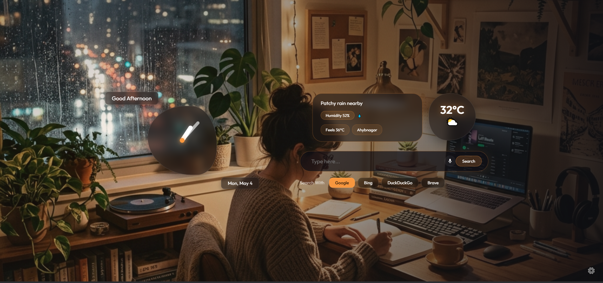

# Aesthetic Chrome New Tab Extension 🎨

A premium, highly customizable Chrome New Tab extension featuring glassmorphism design, dynamic themes, and integrated productivity widgets.

## ✨ Features

- **Premium Aesthetics**: High-end glassmorphism UI with smooth animations and transitions.
- **Dynamic Themes**:
  - **Light & Dark Modes**: Optimized for day and night use.
  - **System Sync**: Automatically follows your OS theme.
  - **Adaptive Glass**: Choose an accent color and watch the whole interface (clocks, borders, glows) adapt instantly.
- **Advanced Clocks**:
  - **Analog Clock**: Minimalist design with smooth hand movements.
  - **Digital Clock**: High-visibility bold typography with themed glows.
  - **Toggleable**: Hide or show either clock style.
- **Voice Search**: Integrated Web Speech API for hands-free searching.
- **Productivity Widgets**:
  - **Weather**: Real-time temperature, humidity, and condition updates.
  - **Search Engines**: Quick switch between Google, Bing, DuckDuckGo, and Brave.
- **Sidebar Settings**: Elegant slide-out menu with accordion-style categorization.
- **Wallpaper Management**:
  - **Preset Gallery**: Choose from a curated selection of high-quality backgrounds.
  - **Custom Upload**: Use your own local images as backgrounds.
- **Privacy Focused**: No tracking, all settings are stored locally in your browser.

## 🚀 Installation

1. **Download** or clone this repository.
2. Open Chrome and navigate to `chrome://extensions/`.
3. Enable **Developer mode** (top right corner).
4. Click **Load unpacked** and select the folder containing these files.
5. Open a new tab and enjoy!

## 🛠️ Built With

- **HTML5**: Semantic structure.
- **Vanilla CSS**: Custom glassmorphism engine using `backdrop-filter` and `color-mix`.
- **JavaScript**: Real-time state management and widget logic.
- **wttr.in**: Real-time weather data.

## 📂 Project Structure

- `manifest.json`: Extension configuration (Manifest V3).
- `newtab.html`: Main extension structure.
- `styles.css`: Full design system and animations.
- `script.js`: Core logic, state, and event handling.
- `assets/`: Contains wallpapers and icons.
  - `icon.png`: Default background and extension icon.
  - `bg1-3.png`: Preset wallpapers.
  - `Preview_demo.png`: Repository preview image.

## 📄 License

This project is open-source. Feel free to customize it to your liking!

---
Developed by Mynoor Reza
